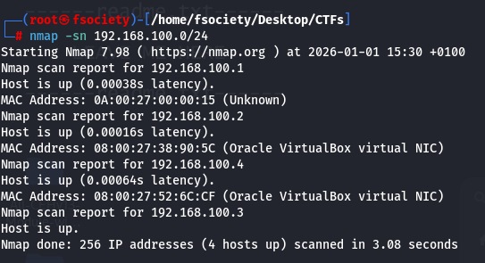
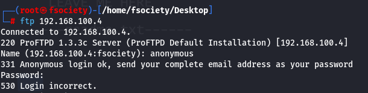
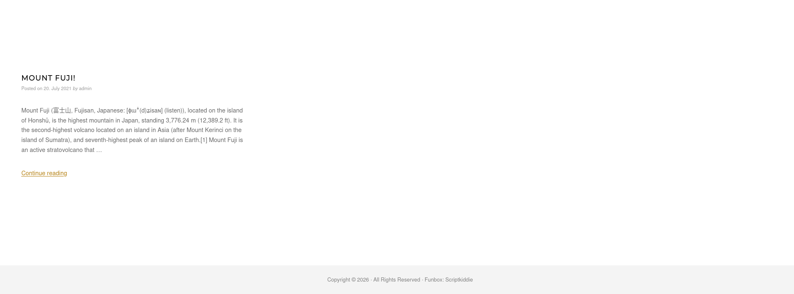
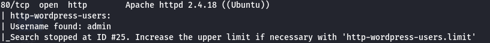
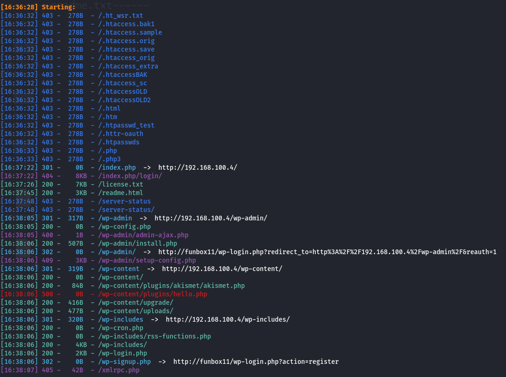
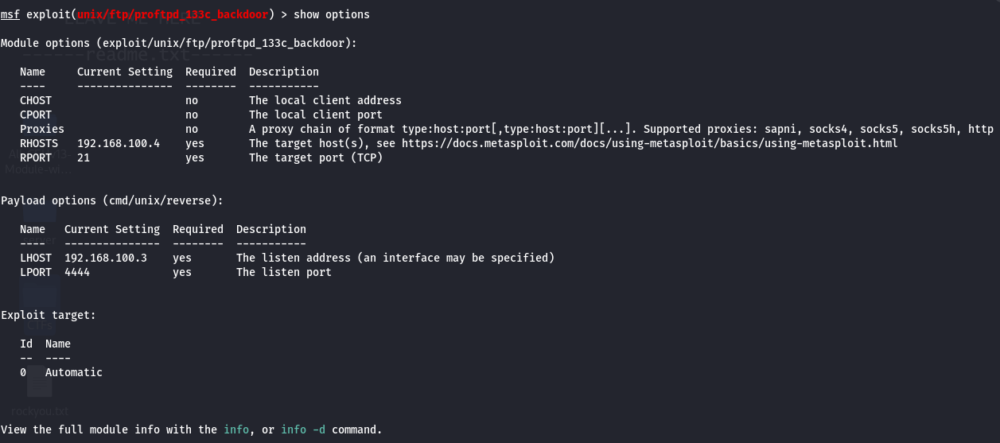
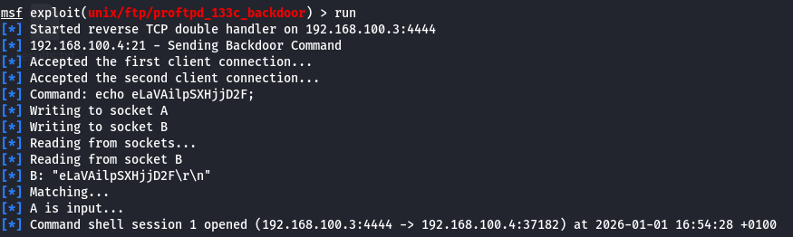
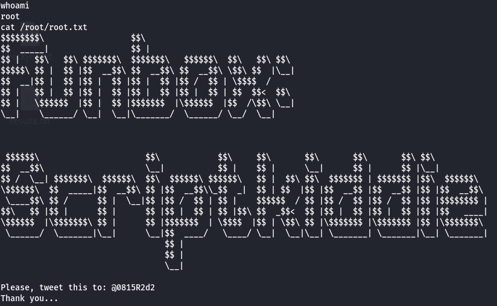

Funbox11: ScriptKiddie (Source: https://vulnhub.com/entry/funbox-scriptkiddie,725/) (Also don't forget to add funbox11 to /etc/hosts)

First things first I needed to learn the targets IP address so I ran a simple nmap discovery scan.

    192.168.100.1 --> Host machine / virtual router (gateway)
    
    192.168.100.2 --> DHCP server
    
    192.168.100.3 --> Attacker VM (Kali)
    
    192.168.100.4 --> Target VM
    

After identifying the targets IP address I had to learn more about it, so I ran following comamnd:

    nmap -sV -O -sC --script=vuln -T 4 192.168.100.4 -oN results.txt
    
        -sV             --> Determines service / version info
        
        -O              --> Determines which OS is running
        
        -sC             --> Runs the default nmap scripts
        
        --script=vuln   --> Runs nmap vulnerability scans
        
        -T 4            --> Faster timing option (default: 3)
        
        -oN             --> Outputs the scan results to a file called "results.txt"

So we can see that FTP, SSH, SMTP, HTTP, POP3, NetBIOS-ssn & IMAP are running.

This configuration suggests a mail server.

Since FTP is open I tried an anonymous login and got this message.

Let's check out the website itself. Maybe we can find something?

After a little while I found the author of the article: "admin"

"admin" is maybe a valid username on the target system? --> If we take a look at the nmap scan results this shows up:

Now let's go on to directory enumeration.

    dirsearch -u http://192.168.100.4/

We can ignore HTTP 403's since we cannot access them anyways.

I went through each directory and nothing seemed interesting to me, so I'll start looking at the other running services and their respective versions.

Starting with FTP - It runs ProFTPD 1.3.3c and after a quick google search I learned that this version of ProFTPD is vulnerable to Backdoor Command Execution (CVE-2010-20103).

The exploit is available in Metasploit. (unix/ftp/proftpd_133c_backdoor)

