Funbox: Rookie    (Source: https://vulnhub.com/entry/funbox-rookie,520/)

Let's start off by finding out the target machines IP address

    nmap -sn 192.168.240.0/24

        -sn     -->     Skips port scan

        ..0/24  -->     Scans the entire subnet

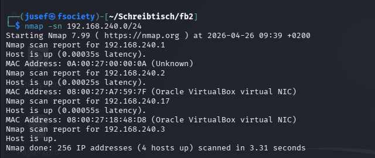

Let's continue by finding open ports and services on that server.

    nmap -p- -T 4 192.168.240.17

        -p-     -->     Scans all 65535 ports

        -T 4    -->     Sets the timing option to 4 (default: 3)

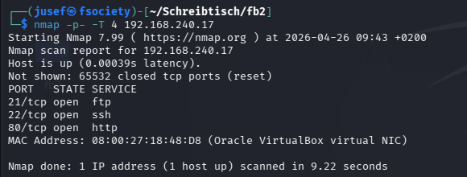

And I'll run this command too:

    nmap -p 21,22,80 -sVC -T 4 192.168.240.17 -oN results.txt

        -p [port list]  --> Scans only the specified ports

        -sV             --> Enables service version detection

        -sC             --> Runs default nmap scripts

        -T 4            --> Sets the timing option to 4 (default: 3)

        -oN             --> Outputs the scan results into a file called results.txt (in this case)

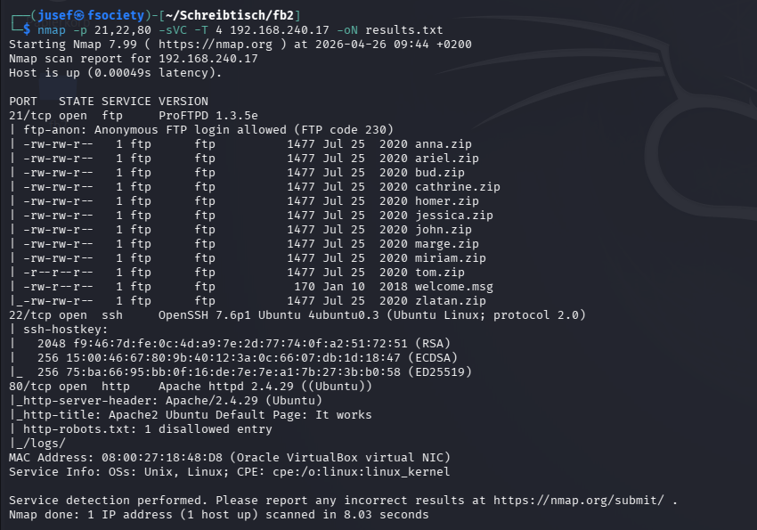

So from what we can see, anonymous FTP login is allowed, but before I try the FTP route, I want to check out the website first.

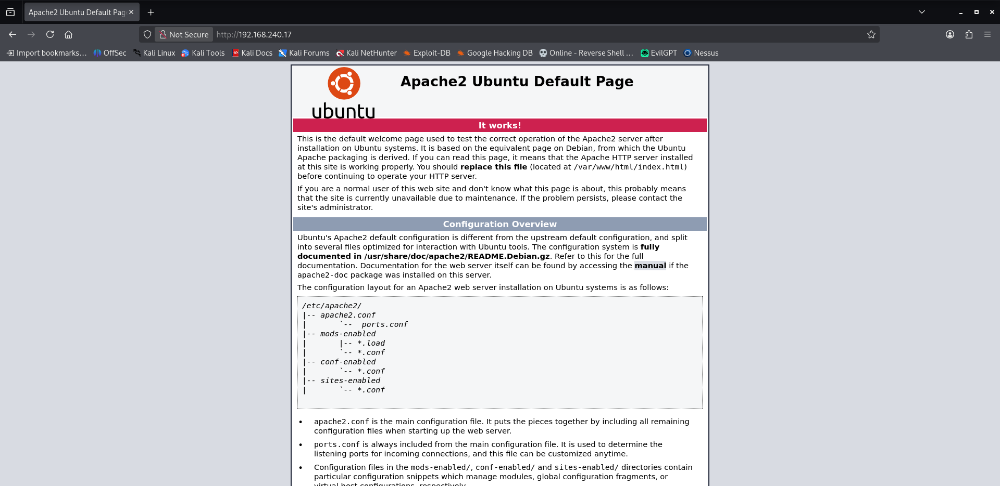

Well thats just the default Apache2 site, I also checked out the page's source code, but again there was nothing. But just to make sure that I'm not missing anything, I'll try directory enumeration using gobuster.

    gobuster dir -u http://192.168.240.17 -w /usr/share/wordlists/dirbuster/directory-list-2.3-medium.txt

        dir     -->     Directory enumeration mode

        -u      -->     Defines the URL

        -w      -->     Defines what wordlist to use

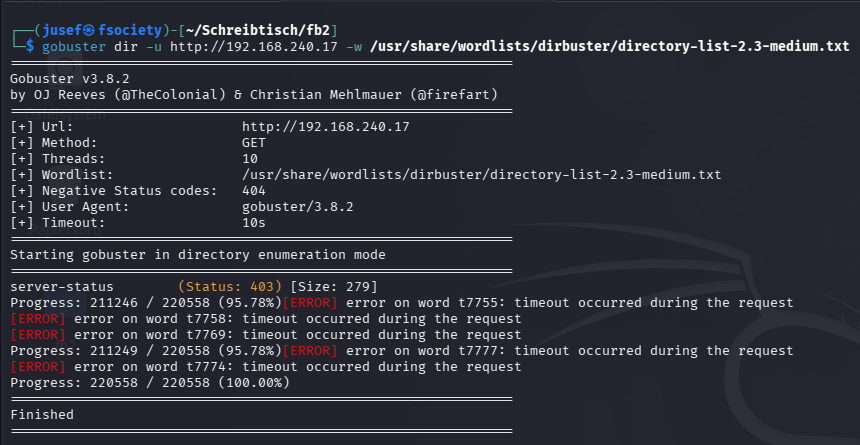

Directory enumeration also didn't yield any fruit. All I found was the robots.txt file, which contents I already saw in my last nmap scan.

Since FTP allows anonymous logins, it would be logical to try and see what we can do with it.

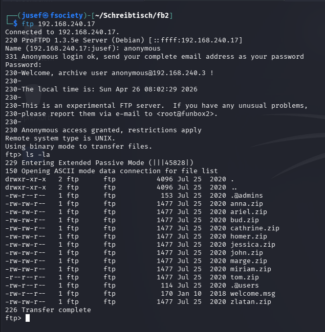

Before viewing any of the .zip files, I want to see the contents of .@admin and .@users.

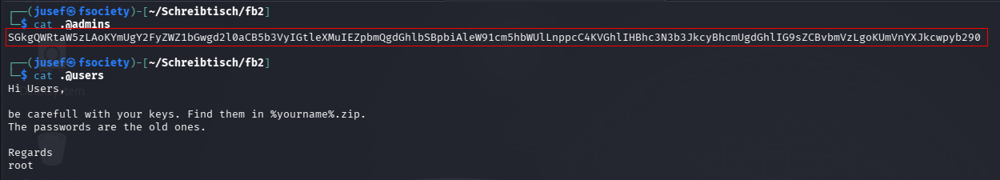

The contents of .@admins seems to encoded in Base64. After decoding, we get this message:

    'Hi Admins,

        be carefull with your keys. Find them in %yourname%.zip.
        The passwords are the old ones.

    Regards
    root'

Let's now have a look at the numerous zip files on that FTP server.

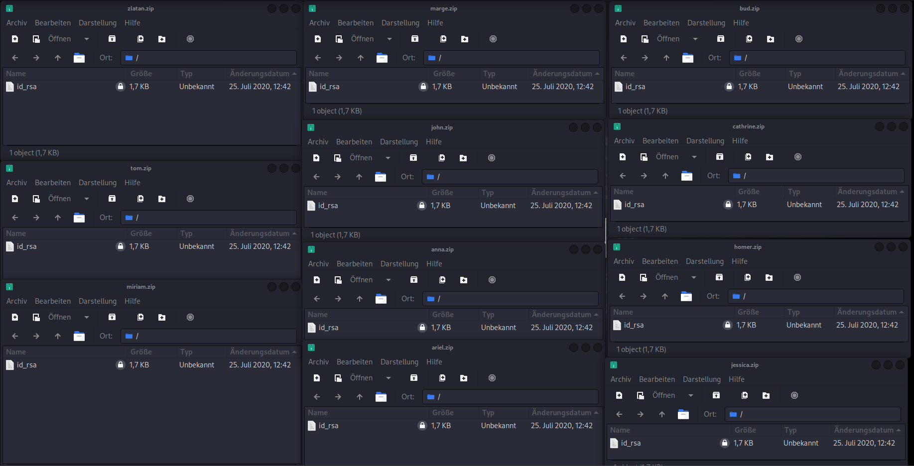

The zip files all seem to be encrypted. We can use a tool called 'fcrackzip' and the rockyou.txt wordlist to try and crack the passwords for these zip files.

    fcrackzip -u -D -p /usr/share/wordlists/rockyou.txt %yourzipfile%.zip

        -u      --> Uses unzip to weed out wrong passwords (If you do not specify this option, fcrackzip will display all passwords that it tries --> lots of unnecessary ouput)
                    
        -D      --> Enables dictionary attack

        -p      --> Specifies which wordlist to use

After trying each and every zip file, I found the following

    tom.zip         --> iubire

    cathrine.zip    --> catwoman

After unzipping, we get id_rsa key files, which we can use to log in through ssh without specifying a password.

From what we can see from the picture below, cathrine's key didn't work, but tom's did.

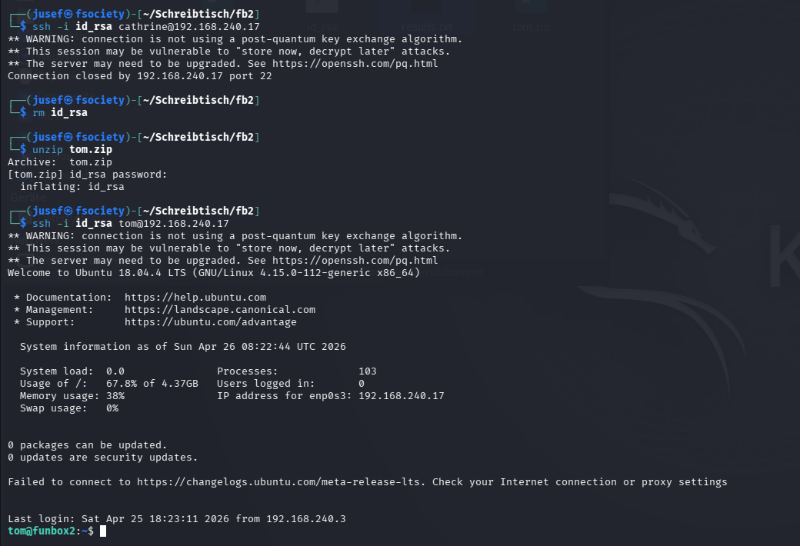

Now lets try and explore the system for a bit.

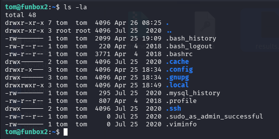

Why is there a mysql_history file if MySQL is not running on here? Let's inspect it further.

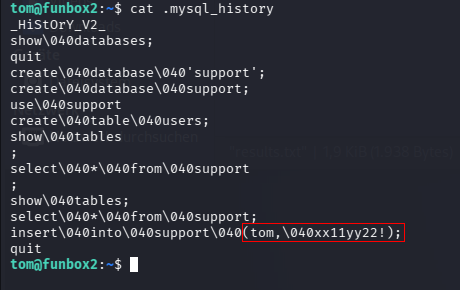

Looks like we found some credentials

    tom         -->     Username
    \040        -->     Octal for ASCII space character
    xx11yy22!   -->     Password

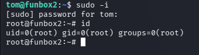

Great! Now that we're running as the root user, we can view the flag!

Thank you for reading!