Jangow 1.0.1    (Source: https://vulnhub.com/entry/jangow-101,754/)

First I need to learn the target VMs IP address so I ran a simple nmap discovery scan.

    nmap -sn 192.168.100.0/24

        -sn                 --> Host discovery scan

        192.168.100.0/24    --> Scans the entire subnet

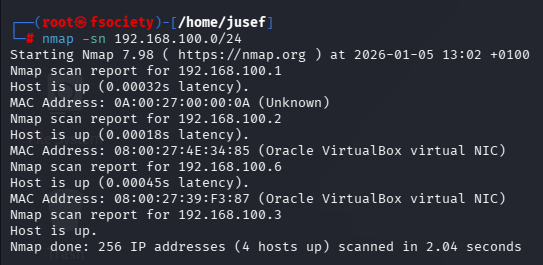

    192.168.100.1 --> Host machine / virtual router (gateway)
    
    192.168.100.2 --> DHCP server
    
    192.168.100.3 --> Attacker VM (Kali)
    
    192.168.100.6 --> Target VM

Great! Now that we know that the target VMs IP address is indeed 192.168.100.6, we can conduct a more comprehensive scan to learn more about this machine and the services running on it.

You can see the results here:   

Now we know that FTP & HTTP are open for connections.

Before we check out the website, let's find out if FTP allows anonymous logins.

Aaaand it indeed does not allow anonymous logins.

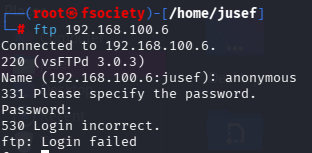

Let's check out the website.

Interestingly, when clicking on the "Buscar" section it just returns an empty page. Also, the url ends in "=" The buscar parameter is reflected in command input, possibly indicating a command injection vulnerability.

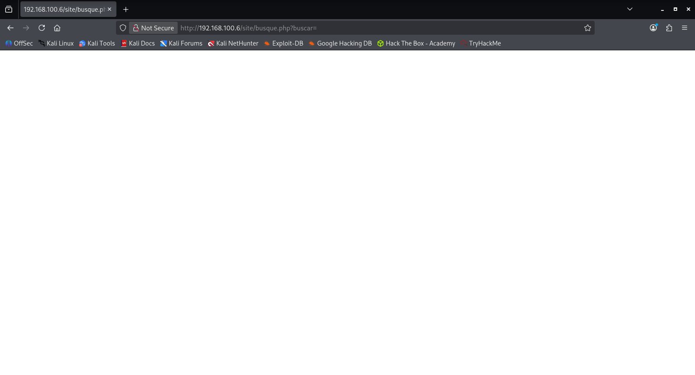

And indeed it is vulnerable to command injection. When typing "ls" (command to list directory contents) it returns the following:

And after a bit of exploration we got the user flag.

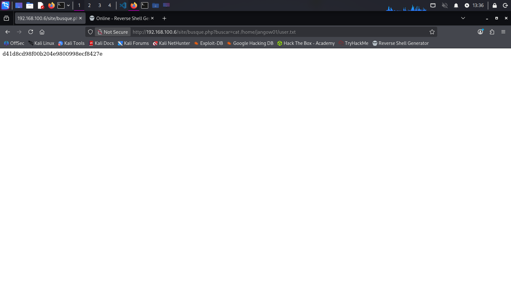

Also, we can see a wordpress folder.

After doing some digging in the WordPress folder, i found another folder called "backups" and in there is a file called "config.php"

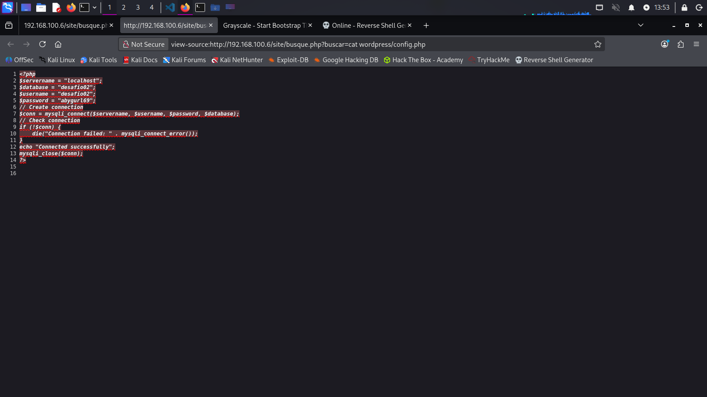

Let's try the login details.

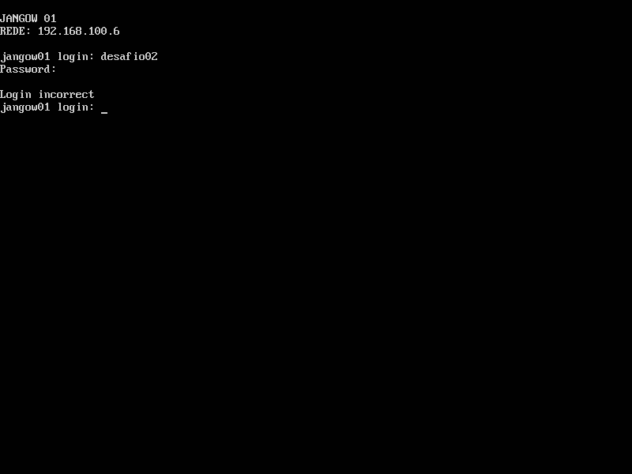

Aaand that didn't work. Well let's think about this clearly: In every Linux system, each user has a separate folder in the /home directory. And looking back at the results of the command "ls -a /home", a folder called "desafio02" didn't exist. The only explanation for this is that the username was never registered on the system. But "jangow01" was. And when trying the credentials "jangow01:abygurl69"... well we can log in.

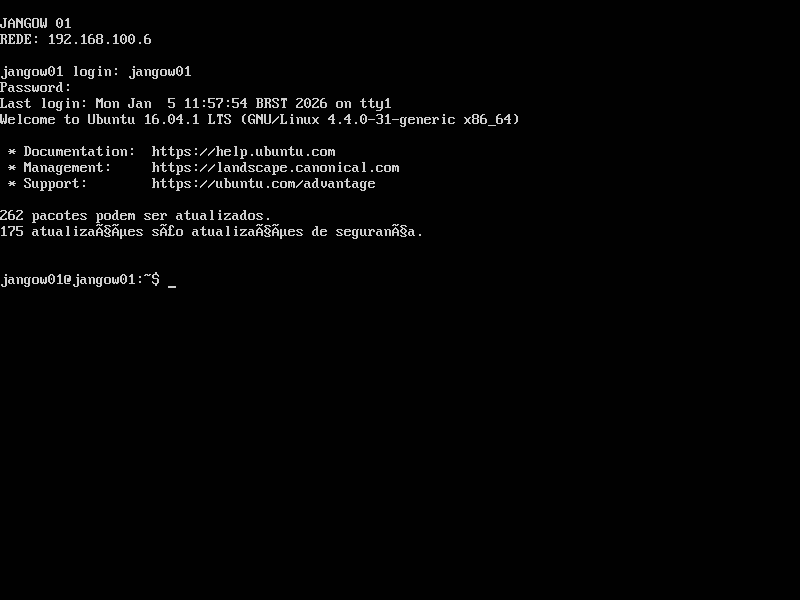

Aaand the machine is in Portuguese and has a different keyboard layout than what I am used to. This may take a while.

So the next step would be to gain root privileges. Since no SUID binaries or sudo privileges were available, I investitgated kernel-level privilege escalation. In order to find the Linux kernel, we must run:

        uname -a

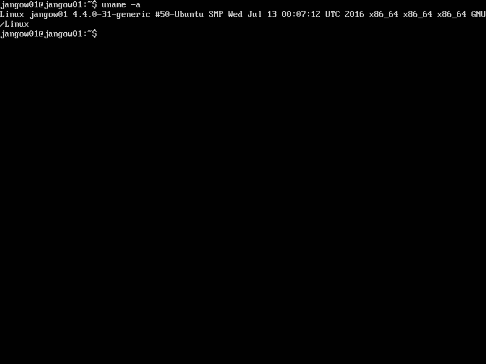

Based on the kernel version 4.4.0-31, I identified a known local privilege escalation vulnerability affecting this kernel.
The exploit is available at: https://github.com/Jewel591/Privilege-Escalation/blob/master/45010.c

We will use FTP to upload the file to the machine.

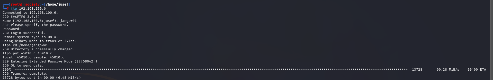

Now lets make it executable.

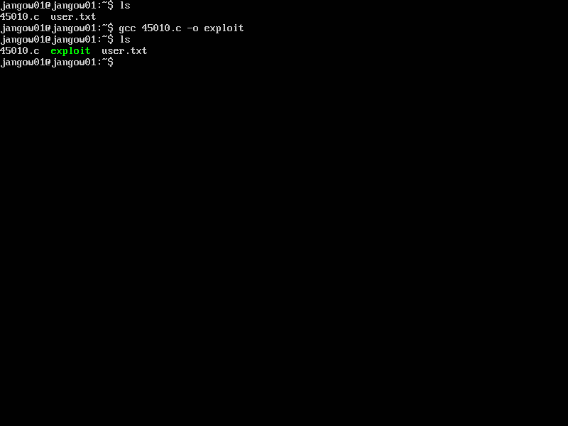

And there is the root flag. (proof.txt in /root)

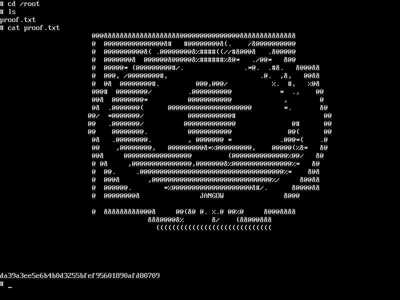
