NoobBox (Source: https://vulnhub.com/entry/noobbox-1,664/)

Let's begin by discovering the target machine's IP address.

    nmap -sn 192.168.240.0/24

        -sn     -->     Skips port scan

        ..0/24  -->     Scans the entire subnet

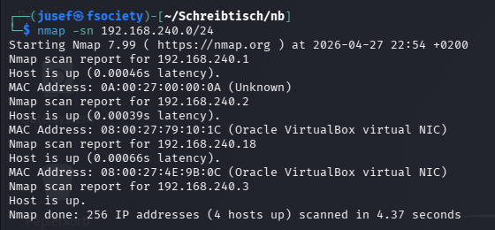

Great! Now that we know that the machine's IP address is 192.168.240.18, we can now begin to learn a bit more about this machine.

    nmap -p- -T 4 192.168.240.18

        -p-     -->     Scans all 65535 ports

        -T 4    -->     Sets the timing option to 4 (default: 3)

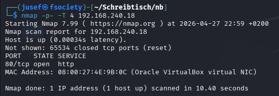

From what we can see, the machine only has port 80 (HTTP) open.

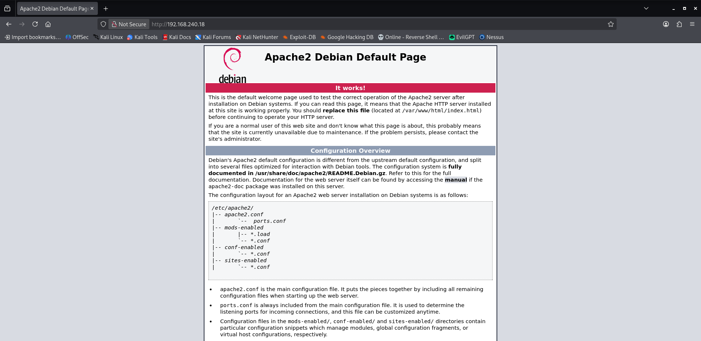

Nothing interesting here at first glance, since it's just the default apache2 site.

Maybe we can find something using directory enumeration.

    gobuster dir -u http://192.168.240.18 -w /usr/share/wordlists/dirbuster/directory-list-2.3-medium.txt -x .php,.txt,.jpg

        -x  -->     Searches for files with the specified extensions (I noticed that I often miss key details, because my directory enumeration is often not thorough enough. Im gonna try
                                                                      to use this option more often.)

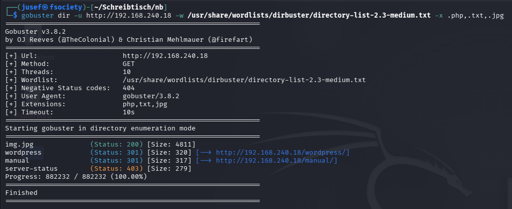

Great! We found some things which could be helpful in the future. Let's try to go through them one by one.

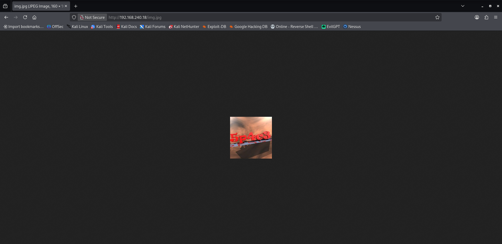

This just says '5p4c3'. Maybe this is some type of credential? Let's keep it in the back of our minds.

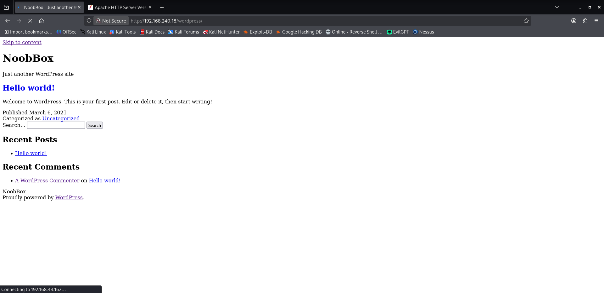

This is some type of blog site. Maybe there's some type of problem on my end because the site refuses to stop loading. Upon further inspection, I realized the site was attempting to connect to 192.168.43.162, which is an unreachable IP address.

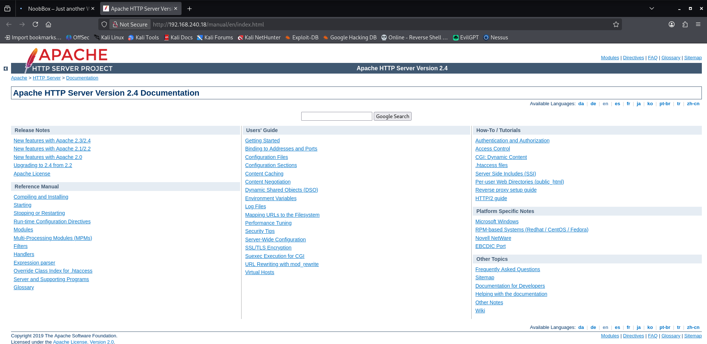

This is just the manual page for apache2 http.

Since server-status responds with HTTP 403 (Forbidden), we can ignore this finding, since we can not access this resource anyways.

Also, since the server is running wordpress on http://192.168.240.18/wordpress/, we can use wpscan to learn more about this blog site.

    wpscan --url http://192.168.240.18/wordpress -e p,t,u

        -e      -->     Searches for whatever option(s) the user has specified. In this case, wpscan searches for plugins, themes and users.

We were able to identify one user called 'noobbox' aswell as the version of wordpress running, which is 5.6.2.

Remember that img.jpg file on this server, which just said '5p4c3'? Maybe thats the password for this machine.

The metasploit module exploit/unix/webapp/wp_admin_shell_upload can be used to spawn a shell on the target machine, given that you have a valid username and password.

Also, lately I've been running into this bug in metasploit: [-] The supplied module name is ambiguous: uninitialized constant HTTP.

I haven't found what causes this bug or a permanent fix, but a temporary solution is to run 'reload_all'.

After configuring and running the exploit..

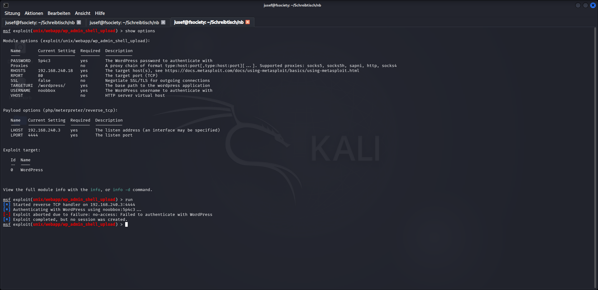

we get this fail message. Upon further inspection, I realized the reason this failed, is because, even though the credentials are correct, wordpress redirects to a email confirmation page.

Well that wont stop us. We can just log into the actual vm and launch a reverse shell from there.

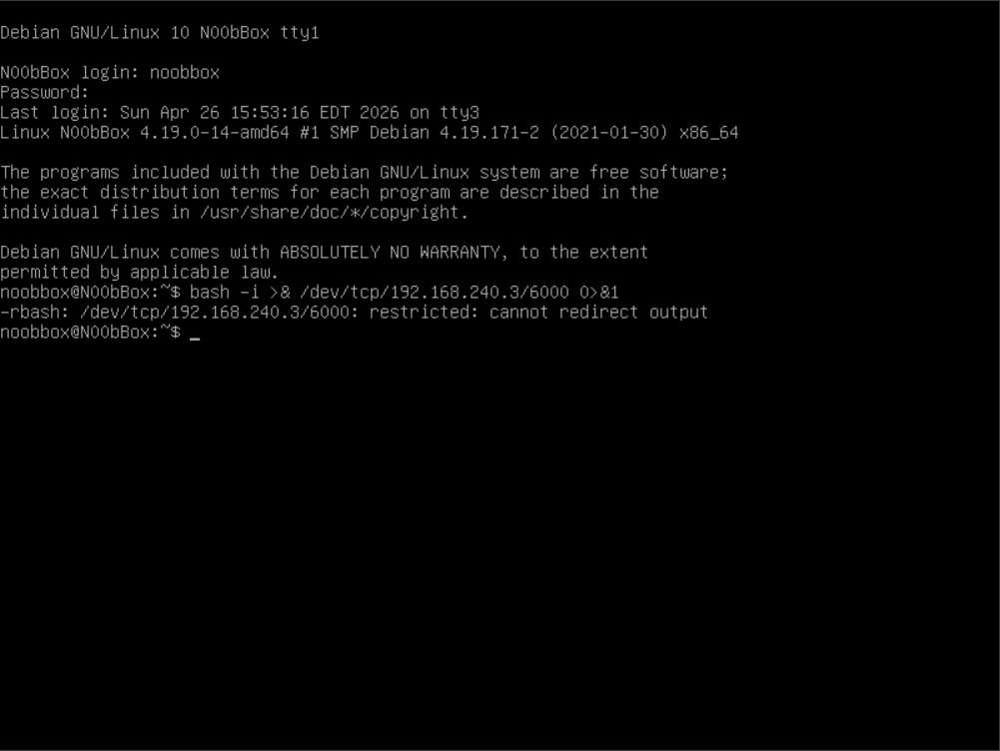

Rbash is a type of restricted bash shell. We can get around this limitation by running the command 'bash'.

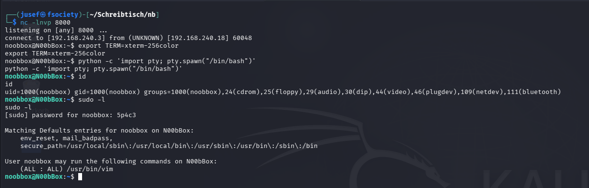

Now we're in, running as 'noobbox', and our sudo privileges are very restricted as we can see from the screenshot above.

The user flag is located in /home/noobbox/user.txt.

    USER FLAG : {e7028891afea8df6164a35880cc7e2e5}

We can run vim with sudo. That is a common privilege escalation method. We can use the following command to become root.

    sudo vim -c ':!/bin/bash'

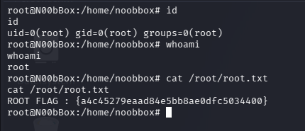

The root flag is located in /root/root.txt

    ROOT FLAG : {a4c45279eaad84e5bb8ae0dfc5034400}

Thank you for reading!